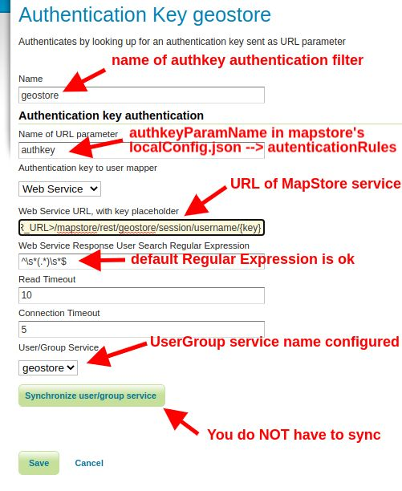
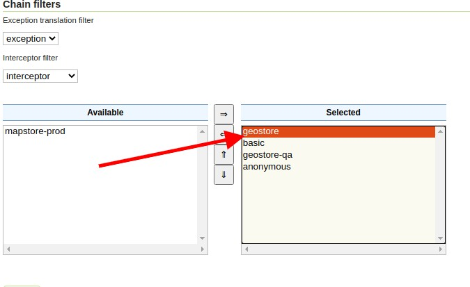

# MapStore2 users GeoServer integration with Authkey

This guide explains how to share users, groups and roles between MapStore and GeoServer.
Applying this configurations will allow users logged in MapStore to be recognized by GeoServer. So security rules about restrictions on services, layers and so on can be correctly applied to MapStore users (also using GeoFence).


With the suggested implementation the MapStore database will be also a UserGroupService and a RoleService for GeoServer.
This means that every user of MapStore will be also a user in GeoServer, with the same attributes, the same roles (ADMIN, USER) and the same user groups.

For every user-group assigned to a user GeoServer will see also **a role** of the same name, from the role service, assigned to the members of the user-group (as user-group derived roles).

Permission on GeoServer can be assigned using these roles or with more detailed granularity using a custom Resource Access Manager (like GeoFence).

## Limits of this solution

This solution partially degradates the functionalities of user management UI of GeoServer (for users, groups and roles that belong to MapStore). If you want to use this solution, you should use the MapStore's user mananger and avoid the GeoSever's one.

## Requirements

1. GeoServer must have the [Authkey Plugin Community Module](https://build.geoserver.org/geoserver/master/community-latest/) installed
1. MapStore2 Database must be reachable by GeoServer (H2 will not work, use PostgreSQL or Oracle)
1. MapStore2 must be reachable by GeoServer

This example will focus on **PostgreSQL** database type
I am assuming this is a new installation, so no existing user or map will be preserved

## Database preparation

1. Follow Geostore wiki to setup a postgresql database (ignore the geostore_test part)
   https://github.com/geosolutions-it/geostore/wiki/Building-instructions#building-geostore-with-postgres-support
1. Start Tomcat once to make it extract the war file
1. Stop Tomcat
1. Copy the WEB-INF/classes/db-conf/postgres.properties file over the WEB-INF/classes/geostore-database-ovr.properties
1. Start Tomcat

### Default user password couples are

- admin:admin
- user:user

## GeoServer Setup

Follow this https://github.com/geosolutions-it/geostore/tree/master/geoserver

Create the empty GeoStore database using scripts as described in GeoStore WIKI
(geosolutions-it/geostore/wiki/Building-instructions#building-geostore-with-postgres-support).

### User Groups and Roles

#### Setup User Group

Steps below refer tp user-group and role service configuration files, as needed download the files from [the geostore repository](https://github.com/geosolutions-it/geostore/tree/master/geoserver).

1. in GeoServer and add a new User Group Service:
    - Select `JDBC`
    - name: `geostore`
    - Password encryption : `Digest`
    - password policy: `default`
    - Driver: `org.postgresql.Driver` (or JNDI)
    - connection url: `jdbc:postgresql://localhost:5432/geostore` (or the one for your setup)
    - set *username* and *password* for the db (user `geostore` with password `geostore`)
    - *JNDI only*: the *JNDI resource name* should look like this `java:comp/env/jdbc/geostore`
    - **Save**

2. When saved, you need to customize the queries to the database to fit the MapStore database.
To do this you have to:
    - Place the provided files in the created directory under `<gs_datadir>/security/usergroup/geostore` .
    - Then go back to geostore user group service (the `ddl` and `dml` path should have values in them)
    - **Save again**

#### Setup Role Service

1. in GeoServer and add a new User Group Service:
    - select: `JDBC`
    - name: `geostore`
    - db: `org.postgresql.Driver`
    - connection url: `jdbc:postgresql://localhost:5432/geostore` (or JNDI, same as above)
    - set user and password (user `geostore` with password `geostore`)
    - save
2. When saved, you need to customize the queries to the ddatabase to fit the MapStore database also for role service, as well as you did for the user-group service. To do this you have to:
    - add the provided files to the geostore directory under `/<gs_datadir>/security/role/geostore` and save again
    - go Again in JDBC Role Service 'geostore'
    - select Administrator role to `ADMIN` (now you should be able to select it)
    - select Group Administrator Role to `ADMIN`
    - **Save again**

### Use these services as default

Now you configured some services in GeoServer to get users and roles from MapStore. Because GeoServer can use only one role service, you need to use these services as default.

- go To Security Settings and set the 'Active role service' to “geostore”
- go to 'Authentication' Section, scroll to Authentication Providers and Add a new one.
- select 'Username Password'
- name it “geostore”
- select “geostore” from the select box
- Save.
- go to "Provider chain" section and move geostore in the right list, on top.
- Save

### Use the Auth key Module with GeoStore/GeoServer

These last steps are required to allow users logged in MapStore to be authenticated correctly by GeoServer.

#### Configure GeoServer

- Install the authkey module in GeoServer.
- Go to the authentication page and scroll into the 'Authentication Filters' section
- Click 'Add new'.
- Inside the 'New authentication Filter' page click on authkey module.
- Insert the name (i.e. 'geostore').
- Leave authkey as parameter name.
- Select the  **Web Service** as 'Authentication key user mapper'.
- Select the created geostore's 'User/Group Service'.
- Input the mapstore2 url:
         `http://<your_hostname>:<mapstore2_port>/mapstore/rest/geostore/session/username/{key}`

         Examples:
         ```
         http://localhost:36728/mapstore/rest/geostore/session/username/{key}
         http://localhost/mapstore2/rest/geostore/session/username/{key}
         http://mapstore.geo-solutions.it/mapstore/rest/geostore/session/username/{key}
         ```
- Save.
;

- Go into the "Authentication" page and open "default" filter chain. 
- Add 'geostore' into the 'Selected' filters and put it on top, and save.


**Note**: in the User Groups and Roles Services available options there are "AuthKEY WebService Body Response - UserGroup Service from WebService Response Body" and "AuthKEY REST - Role service from REST endpoint". Ignore them as they are not supported from MapStore2.

#### Configure MapStore

The last step is to configure MapStore to use the authkey with the configured instance of GeoServer. You can do it by adding to `localConfig.json` like this:

```javascript
//...
"useAuthenticationRules": true,
  "authenticationRules": [{
    "urlPattern": ".*geostore.*",
    "method": "bearer"
  }, {
    "urlPattern": "\\/geoserver/.*",
    "authkeyParamName": "authkey",
    "method": "authkey"
  }],
//...
```

- Verify that "useAuthenticationRules" is set to `true`
- `authenticationRules` array should contain 2 rules:
  - The first rule should already be present, and defines the authentication method used internally in mapstore
  - The second rule (the one you need to add) should be added and defines how to autenticate to GeoServer:
    - `urlPattern`: is a regular expression that identifies the request url where to apply the rule
    - `method`: set it to `authkey` to use the authentication filter you just created in Geoserver.
    - `authkeyParamName`: is the name of the authkey parameter defined in GeoServer (set to `authkey` by default)
